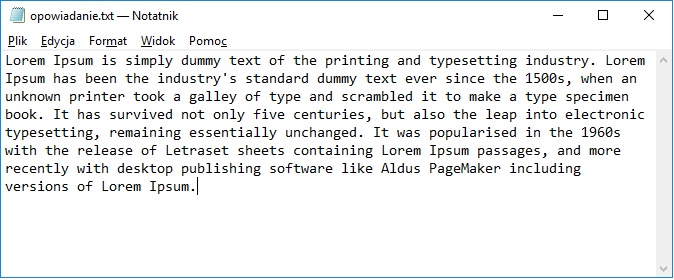
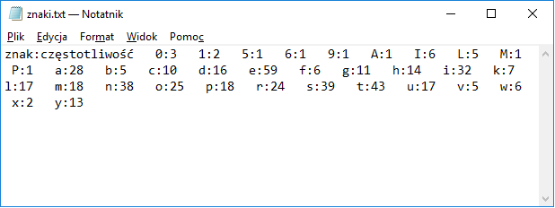

# ReadAndWriteToFile
> Reading stories from the file and writing the number of individual letters to the file.

## Table of contents
* [General info](#general-info)
* [Screenshots](#screenshots)
* [Technologies](#technologies)
* [Setup](#setup)
* [Status](#status)
* [Inspiration](#inspiration)
* [Contact](#contact)

## General info
This program reads text from the file C:\tmp\opowiadanie.txt, counts the number of individual letters in the text and saves them to the file C:\tmp\znaki.txt. 

## Screenshots

## Technologies
* C#
* Visual Studio

## Setup
Click "Clone or download", unzip files, open Zad.10.4.sln in e.g. Microsoft Visual Studio 2017 and click debugging. Your result is in the file:C:\tmp\znaki.txt.
You can change the name of files in the program.

## Status
Project is: finished

## Inspiration
College classes

## Contact
Created by Emil Grabowski emilgrabowski14@gmail.com
